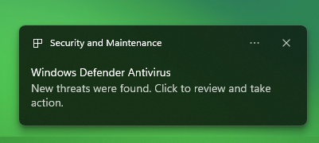
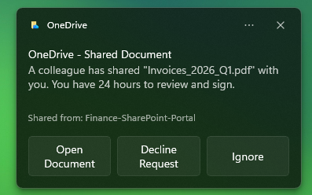

# A study on UI redressing(spoofing) in Windows 11
A dive into how the Windows Runtime (WinRT) notification infrastructure can be utilized for social engineering attacks by impersonating trusted System AppIDs.

## The Problem
Windows allows standard users to invoke notifications to the system tray using any `AppId` and the `ToastNotifcationManager`.

This comes from how Windows identifies apps. Apps are assigned either by automatic assignment using the manifest
(UWP/Packaged apps) or manually using WinRT’s API. We are then going to look up inside the AUMID registry. Unlike the standard
verification applications, which often perform this, it does not check if the process was assigned by the callee, due to the _lack_ of an encryption
method inside the call. If the AUMID exists, Windows grants that notification the visual identity (icon, name, and permissions)
associated with that ID.

If the attacker has successfully spoofed the desired program’s notification, it is only necessary to assign an action to the
evil twin. Usually, clicking a notification launches the app that sent it, by setting the activation type to protocol; however,
the attacker decouples the notification from the sender. This forces the system into handling the provided location.
This is the key part of the attack. By this decoupling, the user thinks he is clicking a trusted system application, but is
tricked by the system into trusting a malicious endpoint.

<ins>So what?</ins> While the executing code is user-privileged, the notification itself carries system authority to the end user.
This creates a **low technical**, but **high social** impact, which could lead to a complete compromise of user credentials.

<figure>
  
  <figcaption>Example of a Windows Defender Antivirus Notification</figcaption>
</figure>
<figure>
  
  <figcaption>Example of a OneDrive Notification</figcaption>
</figure>

## Possible attack paths:
* Vector 1:
  * Attacker executes a low-level binary.
  * This binary sends a toast impersonating a notification as a trusted component.
  * User clicks a button with a protocol activation, launching a malicious URL or pre-installed backdoor handler.
* Vector 2:
  * An attacker could fabricate urgency by prompting the user that they will lose access to their system account.
  * The user clicks on the button to follow, but is led to a third-party “copy-cat” website for information extraction.

## Execution flow analysis:
* First, we link to the windows-rs to access the ABI (Application Binary Interface) of Windows.
* Afterward, we create the custom XML template we are going to use for the notification. Here is where our social engineering nests.
* Then, we call the `CreateToastNotifierWithId` (provided by the `ABI`) and the desired `app_id` we would like to impersonate (in our case `Windows.SystemToast.SecurityAndMaintenance`)
* Finally, we dispatch the notification using the `Show(&toast)` which sends an RPC (Remote Procedure Call) to Windows's Notification service or the local Action Center which renders the notification to the user.

## Mitigation Suggestions: 
* All system notifications should be matched between the sender and the display.
* Windows should display when notifications are sent by third-party executables.
* Visual Attribution: For any notification sent by an unpackaged or unsigned binary, Windows should append a "Sent by: [FileName.exe]" tag to the toast.
* System AppIDs could be randomized, thus making spoofing a notification from an app nearly impossible.

## Estimated CVSS v3.1 Score (5.7, Medium): 
 CVSS:3.1/AV:L/AC:L/PR:N/UI:R/S:U/C:L/I:H/A:N
 
## Research Constraints
Tested and developed for Windows 11 (25H2)
